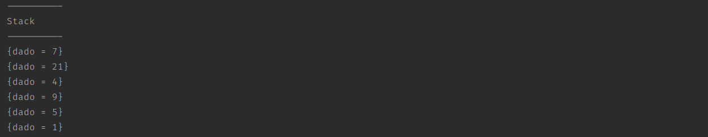

# Content

[ENG](#english)

- [stack](#stack)

[PT-BR](#portuguese)

- [pilha](#pilha)

# English

# Implementation of data structure in java

## Stack

Stack is a filo (First In Last Out) structure. It's similar to a book stack; we always add and remove data on top.

The stack creation is a node that points to a null valuer, and when we add another node, we give a reference to the last node added.

Example: Node 2 will point to node 1; who will point to node 0.

### Stack commands.

#### top().

Returns the last node added.

#### push().

Add a node in the last position.

#### pop().

Remove the last node added.

# Portuguese.

# Estrutura de dados implementada em java.

## pilha.

Pilha é uma estrutura filo (First In Last Out). Similar a uma pilha de livros, adicionamos e removemos os conteúdos no topo.

Na pilha dinâmica, criamos um nó que tem valor nulo, e ligamos o nó x com o nó x-1.

Exemplo: Nó 2 aponta ao nó 1; que apontará ao nó 0.

### Comandos.

#### top().

Exibe o valor do topo.

#### push().

Adiciona um nó na última posição.

#### pop().

Remove o último nó adicionado.
